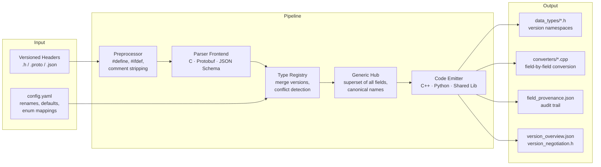

# ductape

[](https://gitlab.com/manju89jay1/ductape/-/pipelines)
[](LICENSE)
[](https://www.python.org/downloads/)

**Automatic version-aware C struct converter generator.**

ductape reads versioned C struct headers and a YAML config, then generates
compilable C++17 converter code using a hub-and-spoke pattern. No manual
converter code. No N-squared version matrix. Just `ductape generate` and compile.

## The Problem

When firmware evolves, struct layouts change. Fields get added, renamed, resized.
With 3 data types across 3 firmware versions, you need **18 manual converter
functions**. With 10 types across 5 versions, that's **100+**. Every one is
hand-written, tested, and maintained.

## The Solution

ductape builds a **generic hub** — the superset of all fields across all
versions — and generates only **2N** converters instead of N²:

```
V1 ──► Generic (hub) ──► V1
V2 ──► Generic (hub) ──► V2
V3 ──► Generic (hub) ──► V3
```

Field renames, default injection, array resizing, and enum remapping are all
handled automatically from config.

## Architecture



## Quick Start

```bash
pip install -e .

# Generate adapters
ductape generate \
    --config variants/reference_project/config.yaml \
    --output build/

# Compile the generated C++
g++ -c build/converters/generated/*.cpp \
    -Ibuild -Iruntime_reference \
    -Ibuild/converters/generated -std=c++17

# Verify against golden files
ductape verify \
    --config variants/reference_project/config.yaml \
    --expected variants/reference_project/expected_output/
```

## Example: Drone Telemetry

A real scenario: firmware V1 has 7 fields, V3 grows to 15 with renames and
nested structs.

**V1 input** (7 fields):
```c
typedef struct {
    uint32 timestamp;
    float32 speed;        // renamed to ground_speed in V3
    float32 altitude;     // renamed to altitude_msl in V3
    float32 heading;
    float32 latitude;
    float32 longitude;
    uint8 status;         // renamed to op_status in V3
    uint8 payload[32];
} TelemetryData_t;
```

**Config** (renames + defaults):
```yaml
types:
  TelemetryData_t:
    version_macro: TELEMETRY_DATA_VERSION
    generate_reverse: true
    defaults:
      vertical_speed: "0.0"
      airspeed: "0.0"
      satellite_count: "0"
    renames:
      speed: ground_speed
      altitude: altitude_msl
      status: op_status
```

**Generated output** (compiles, zero manual code):
```cpp
void Converter_TelemetryData_t::convert_V1_to_Generic(
    TelemetryData_t_V_Gen::TelemetryData_t& dest,
    const TelemetryData_t_V_1::TelemetryData_t& source)
{
    memset(&dest, 0, sizeof(dest));
    dest.timestamp = source.timestamp;
    dest.ground_speed = source.speed;               // rename applied
    dest.altitude_msl = source.altitude;             // rename applied
    dest.heading = source.heading;
    dest.latitude = source.latitude;
    dest.longitude = source.longitude;
    dest.op_status = source.status;                  // rename applied
    for (int i = 0; i < (32 < 64 ? 32 : 64); i++)  // array min-copy
    {
        dest.payload[i] = source.payload[i];
    }
    dest.vertical_speed = 0.0;                       // default injected
    dest.airspeed = 0.0;                             // default injected
    dest.satellite_count = 0;                        // default injected
}
```

## Who This Is For

- **Embedded firmware teams** — devices in the field running different firmware versions
- **Automotive ECU developers** — CAN messages evolving across model years
- **Aerospace/defence** — telemetry structs across avionics software revisions
- **IoT platforms** — aggregating data from heterogeneous device populations

Not for teams already using Protobuf, Avro, or FlatBuffers — those handle version
tolerance natively. ductape fills the gap for **raw C structs**.

## Features

| Feature | Description |
|---------|-------------|
| **Hub-and-spoke converters** | 2N instead of N² converter functions |
| **Field renames** | `speed` -> `ground_speed` tracked across versions |
| **Default injection** | Missing fields get configured default values |
| **Array min-copy** | Safe truncation when array dimensions change |
| **Enum remapping** | `OLD_ACTIVE` -> `NEW_RUNNING` across versions |
| **Field provenance** | JSON audit trail of every field's origin |
| **Golden file verification** | `ductape verify` catches regressions |
| **Plugin architecture** | Pluggable parser frontends and code emitters |
| **Version negotiation** | Runtime version query helpers |

## Supported Formats

### Parser Frontends

| Frontend | Format | Status |
|----------|--------|--------|
| C headers | `.h` with `typedef struct` | Default, full support |
| Protobuf | `.proto` (proto2/proto3) | message, enum, repeated, map, oneof |
| JSON Schema | `.json` (draft-07+) | object, array, $ref, enum |

### Code Emitters

| Emitter | Output | Status |
|---------|--------|--------|
| C++ classes | `Converter_<Type>.h/.cpp` | Default, compiles with g++ |
| Python dataclasses | `converter_<type>.py` | Pure Python |
| Shared library | C source with stable ABI | `.so`/`.dll` |

## CLI Commands

```bash
ductape generate --config CONFIG --output DIR      # Generate adapters
ductape verify --config CONFIG --expected DIR       # Verify golden files
ductape extract-deps --config CONFIG --output DIR   # Extract package headers
ductape diff --previous OLD.json --current NEW.json # Diff version snapshots
ductape struct-diff --dir1 DIR1 --dir2 DIR2         # Structural output diff
```

Add `--no-color` to disable ANSI color output.

## Generated Output

| File | Description |
|------|-------------|
| `data_types/<Type>.h` | All versions in C++ namespaces + generic superset |
| `converters/generated/Converter_<Type>.h` | Converter class declaration |
| `converters/generated/Converter_<Type>.cpp` | Field-by-field conversion |
| `converters/generated/converters.cpp` | Factory registration |
| `converters/generated/version_negotiation.h` | Runtime version helpers |
| `field_provenance.json` | Cross-version field audit trail |
| `version_overview.json` | Active version numbers per type |

## Configuration

```yaml
project:
  name: my_project
  generic_version_sentinel: 9999

format: c_header        # c_header | protobuf | json_schema
emitter: cpp             # cpp | python | shared_lib

header_sources:
  - path: "headers/v1"
    version_tag: "v1"
  - path: "headers/v2"
    version_tag: "v2"

additional_includes:
  - "headers"

types:
  TelemetryData_t:
    version_macro: TELEMETRY_DATA_VERSION
    generate_reverse: true
    defaults:
      airspeed: "0.0"
    renames:
      speed: ground_speed
    enum_mappings:
      status:
        OLD_ACTIVE: NEW_RUNNING
    field_warnings:
      op_status:
        note: "Bitmask in V1-V2, enum in V3+"
        severity: 1

warnings:
  min_display_severity: 1
  color: true
```

## Ecosystem Integration

ductape works with C struct headers from any tool:

| Domain | Tool | Produces |
|--------|------|----------|
| MAVLink (drones) | `mavgen` | C structs from XML |
| Protobuf (embedded) | `nanopb` | Fixed-size C structs from .proto |
| ROS (robotics) | `rosidl_generator_c` | C structs from .msg files |
| CAN bus (automotive) | `cantools`/`dbcc` | C structs from .dbc files |

## Prior Art

| System | Approach | How ductape differs |
|--------|----------|-------------------|
| Apache Avro | Runtime schema resolution | Compile-time converters |
| ROS rosbag migration | Semi-manual Python rules | Fully automatic from YAML |
| Linux `copy_struct_from_user()` | Runtime size-based zero-extension | Handles renames, defaults, arrays |
| Protobuf/FlatBuffers | Wire format version tolerance | Works with raw C structs |

## Limitations

- **Parser**: supports `typedef struct/union/enum`, `#define`, `#ifdef`. Does not support function pointers, C++ classes/templates, or complex macros
- **Python emitter**: generates code but doesn't handle nested struct copying
- **Rust emitter**: not yet implemented (plugin architecture ready)
- **Scope**: schema-level adapter only, not a serialization library

## Testing

179 tests across 15 test files. Generated C++ compiles with `g++ -std=c++17`.
Scale tested at 50 types x 5 versions. All 35 requirements (27 FR + 8 NFR) met.

```bash
pytest tests/ -v                    # Run all tests
bash scripts/pre-push.sh            # Full local CI pipeline
```

## Repository Structure

```
ductape/
├── pyproject.toml                    Package config
├── ductape/                          Python package
│   ├── cli.py                        CLI dispatch
│   ├── codegen.py                    Generation driver
│   ├── config.py                     YAML config loader
│   ├── conv/                         Core engine
│   │   ├── preprocessor.py           #define, #ifdef handling
│   │   ├── parser.py                 Recursive-descent C parser
│   │   ├── type_registry.py          Multi-version type collector
│   │   ├── converter.py              Conversion code generator
│   │   └── field_provenance.py       Audit report generator
│   ├── frontends/                    Parser frontends (pluggable)
│   └── emitters/                     Code emitters (pluggable)
├── variants/reference_project/       Reference: 3 types x 3 versions
├── runtime_reference/                Adapter runtime headers
├── tests/                            179 tests
└── docs/                             Architecture spec, build phases
```

## Contributing

See [CONTRIBUTING.md](CONTRIBUTING.md) for development setup, testing, and workflow.

## License

[MIT](LICENSE)
